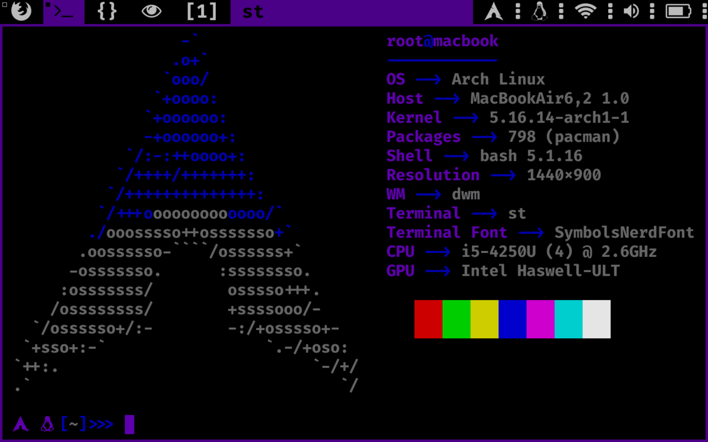

# ArchNemo ISO generator
This is a custom arch ISO generator to build my own setup and configure it as much as possible to meet my needs!



<!-- TABLE OF CONTENTS -->
## Table of Contents

* [Setup](#setup)
* [License](#license)
* [Credits](#credits)

## Setup

### Download the project:
```
$ git clone https://github.com/nemo256/archNemoISO
$ cd archNemoISO
```

### Create a <airootfs/root/.env> file:
```
USERNAME=             # your username (eg: foo)
PASSWORD=             # your password (eg: bar)
HOSTNAME=             # your hostname (eg: thinkpad)
SHELL=                # preferred shell (eg: /bin/zsh)
TOKEN=                # this is the github token (you can leave it empty)
DISK=                 # disk you want to install archNemo on (eg: /dev/sda)
MOUNT_OPTIONS=        # disk mount options (eg: "noatime,compress=zstd,ssd,commit=120")
FS=                   # filesystem type (can be ext4, btrfs...)
TIMEZONE=             # timezone like this <Continent/city> (eg: Europe/paris, America/chicago)
KEYMAP=               # keymap of the keyboard (eg: us, fr, es...)
```

### Personalize <build.sh> file:
- This is my personal arch build profile, so you can start by customizing the build.sh file, update your own personal git repos (dotfiles and such).
- You can also add any personal directories and custom files to add them directly to your custom build, path is airootfs/root/<here>.

### Finally, just make build.sh executable and run it to create your custom arch build:
```
$ chmod +x build.sh
$ ./build.sh
```

### Now, your custom ISO is located in out/, and create a bootable flash drive: (eg: usb is /dev/sdb)
```
$ mount /dev/sdb /mnt
$ bsdtar -x -C /mnt -f out/archnemo-<version>.iso
```

## License
- Please read archNemoISO/LICENSE.
- If you're too lazy to read, do anything you want with this project and don't forget to give credits to me, and the developers of the [archiso](https://github.com/archlinux/archiso) tool.

## Credits
- Credits go to the developers of [archiso](https://github.com/archlinux/archiso).
